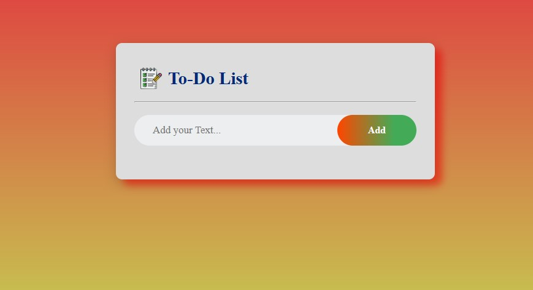
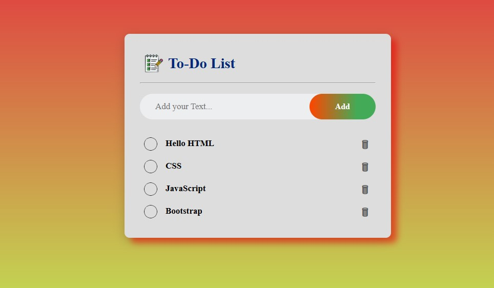

# ✅ To-Do List Web App – by Pranay Kamble

A simple, clean, and fully functional **To-Do List** web application created using **HTML, CSS, and JavaScript**.  
This app supports adding tasks, marking them as complete, deleting them, and automatically saving all actions using browser `localStorage`.


 

---

## 🧠 Features

- 📋 Add, check off, or delete tasks with a single click
- 💾 Automatically saves tasks using `localStorage`
- 🎨 Styled with modern CSS + gradients + box shadows
- 🧠 Click a task to mark it as complete (strike-through)
- 🗑 Delete button (🗑 icon) for task removal

---

## 🚀 Technologies Used

- **HTML5** – structure of the page  
- **CSS3** – layout, colors, gradients, and effects  
- **JavaScript** – all core interactivity logic + localStorage

---

## 📸 Screenshots

### Home View  


### Checked Task Example  


---

## 📂 File Structure

```
├── index.html                  # Main HTML structure
├── style.css                   # UI design and effects
├── script.js                   # Add/delete/check tasks + save to localStorage
├── images                      # Folder name to stored images
    ├── Circle_d.png            # Check box empty 
    ├── list.png                # Title logo
    ├── Right.png               # After Checked Circle 
    ├── to-do-list.jpg          # Home screen screenshot
    ├── to-do-preview .jpg      # Checked task preview screenshot
├── README.md                   # Project information MD file
```

---
## 🌐 Live Preview

You can directly Access To-Do List here:
👉 [Live Link]( https://pranay-kamble3.github.io/To-Do-List/)

---

## 👨‍💻 Author

Created by **Pranay Kamble**  
📧 pranaysk31@gmail.com | [LinkedIn](https://linkedin.com/in/pranay-kamble-003b1a264)

---

## 📃 License

This project is for learning and educational purposes only.
